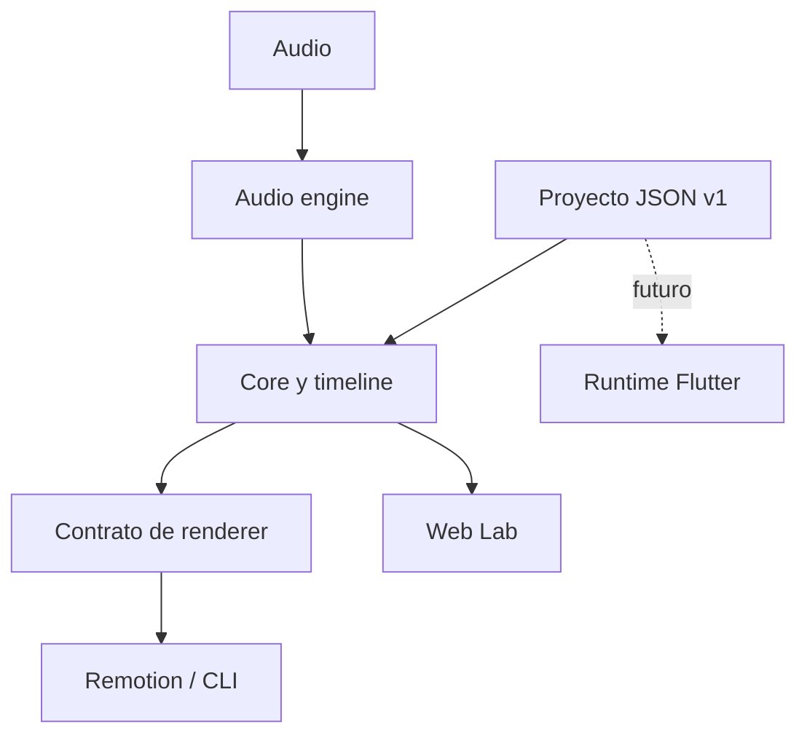

# Arquitectura

EDITuber es un monorepo con un contrato compartido y varios adaptadores.

## Límites

- `contracts` contiene datos, esquema y validación; no conoce UI ni renderizadores.
- `audio-engine`, `timeline-engine` y `avatar-engine` son deterministas y no importan Remotion.
- `core` coordina la carga de datos y el estado de cada frame.
- `renderer-contract` define la interfaz intercambiable.
- `renderer-remotion` adapta el estado compartido a video.
- `web-lab` usa las mismas funciones puras; no mantiene una segunda máquina de estados.

La previsualización se gobierna con el frame derivado del tiempo del audio. El reloj del navegador
solo selecciona el frame; no participa en el cálculo de la animación.
