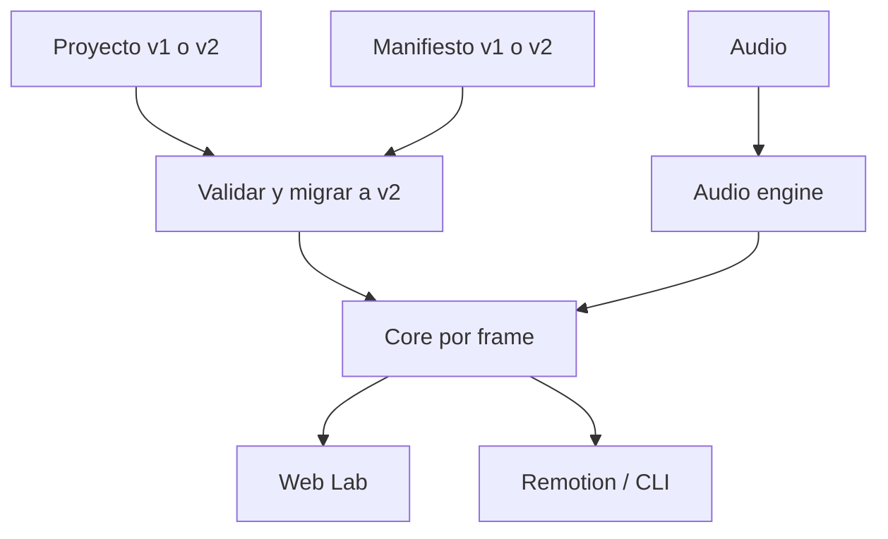

# Arquitectura

EDITuber es un monorepo con un contrato v2 compartido y adaptadores de entrada/salida.



## Flujo por frame

```text
stateEvents + frame
        │
        ▼
resolveStateAtFrame ──► currentStateId + crossfade
        │
        ▼
resolveStateImage(state, speaking, blinking)
        │
        ├─ 2 imágenes: ojos abiertos
        └─ 4 imágenes: parpadeo completo
        │
        ▼
resolveAvatarTransform(frame, seed, envelope, motionPreset)
        │
        └─ translate + scaleX/Y + rotation sobre un único padre
```

El reloj del navegador solo selecciona un frame. Las decisiones visuales dependen de frame, FPS, semilla, datos y envolvente; Web y render producen el mismo resultado. `prefers-reduced-motion` neutraliza el movimiento adicional solo en la previsualización web.

## Límites de archivos de la CLI

```text
argumento --asset-root (confianza del usuario)
        │
        ├─ realpath de proyecto, audio, manifiesto e imágenes
        ├─ comprobación canónica de contención
        └─ solo lectura

argumento --cache-root o <asset-root>/.edituber-cache
        │
        └─ escritura exclusiva <audioHash>-<fps>.envelope.json
```

El proyecto no controla una ruta de escritura. `audio.envelope` es una referencia opcional de lectura; si falta o está obsoleta, la salida va a la caché confiable.

## Límites de módulos

- `contracts`: datos, esquemas, validación y migración; no conoce UI ni render.
- `audio-engine`, `timeline-engine` y `avatar-engine`: funciones deterministas sin Remotion.
- `core`: valida el bundle y resuelve el estado del frame.
- `renderer-remotion`: adapta el estado compartido a video.
- `web-lab`: administra estados y usa las mismas funciones puras.
